# ADOBE XD

## DISEÑO DE INTERFACES

### INTRODUCCIÓN

Adobe XD es la apuesta de Adobe por competir en el mundo del diseño de interfaces. Cubre todo el proceso de creación de wireframes, mockups y prototipos. Es un programa ligero que ofrece lo que necesitas cuando lo necesitas, cuenta con una interfaz intuitiva

En este curso aprenderás a usar todas las herramientas de Adobe XD y crearás un proyecto que se llama flick.

### CREACIÓN DE UN DOCUMENTO

Los **Artboards** son tamaños de documentos que nos proporciona Adobe XD con sus respectivos usos como móvil, tablet, web y una opción personalizada.

### INTERFAZ Y NAVEGACIÓN

El zoom se puede encontrar en dos lugares: arriba a la derecha o a la izquierda como última opción en la barra de herramientas. También podemos seleccionarla usando la tecla Z.

Una vez seleccionada damos click para hacer un zoom in y click manteniendo oprimido Alt para hacer zoom out.

- Cmd/Ctrl + 1: Lleva el zoom al 100%
- Cmd/Ctrl + 2: Lleva el zoom a 200%
- Cmd/Ctrl + 3: Ver centrado en pantalla un objeto seleccionado.

### ATAJOS DEL TECLADO

XD ofrece atajos de teclado que agilizan el trabajo. Estos son los más populares:

#### MENU EDITAR

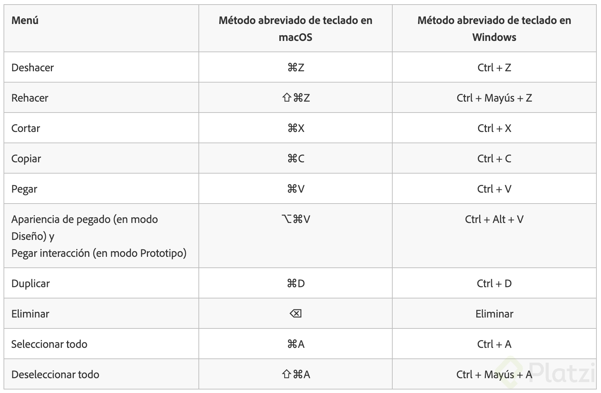

#### MENU ARCHIVO

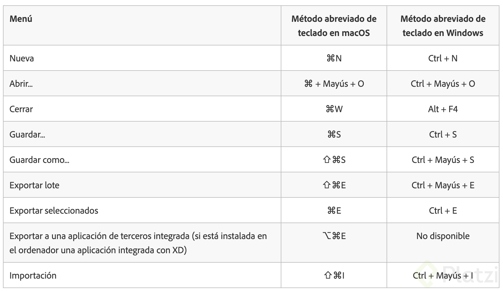

#### TRAZADO / PLUMA

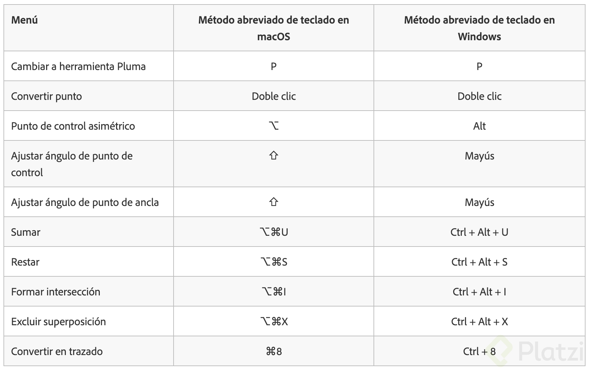

#### OBJETOS GRUPOS Y MESAS DE TRABAJO

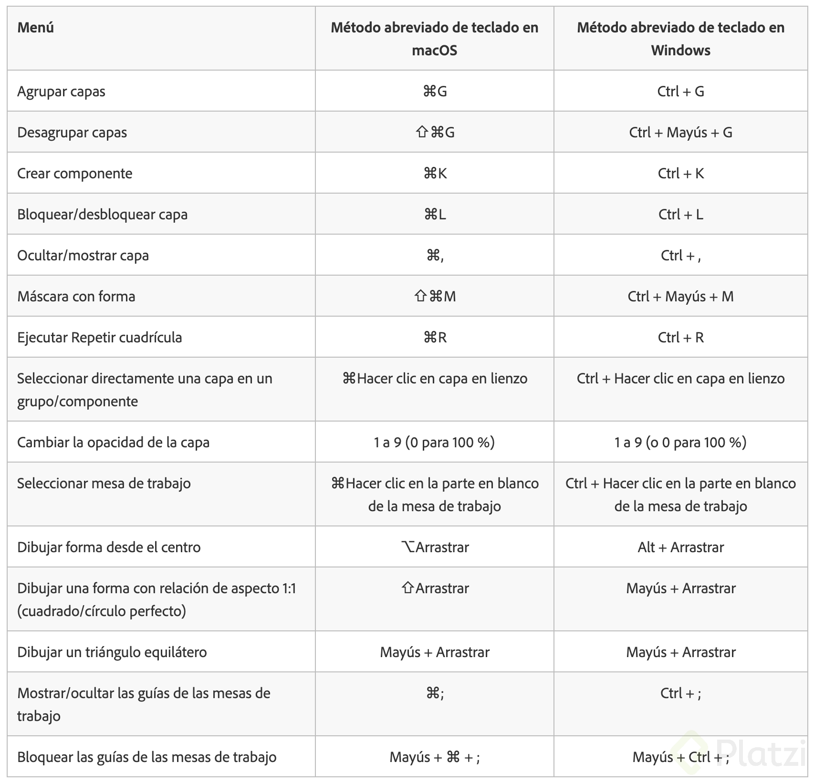

#### ALINEACIÓN

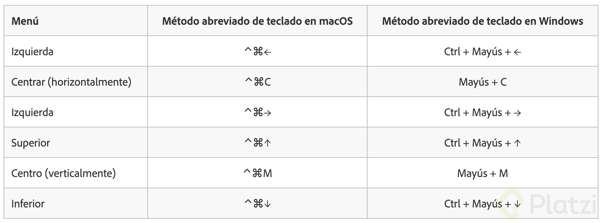

#### ORGANIZACIÓN

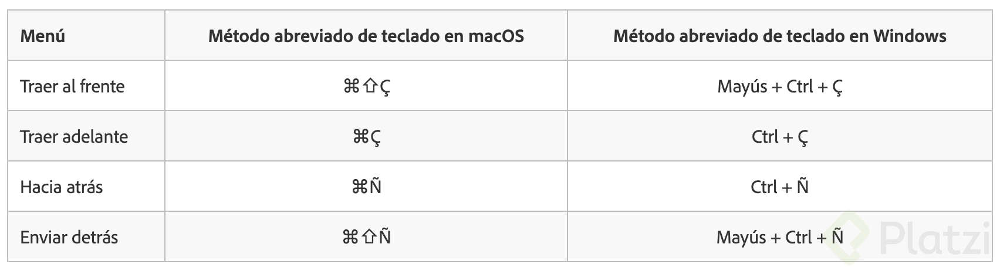

#### DISTRIBUCIÓN

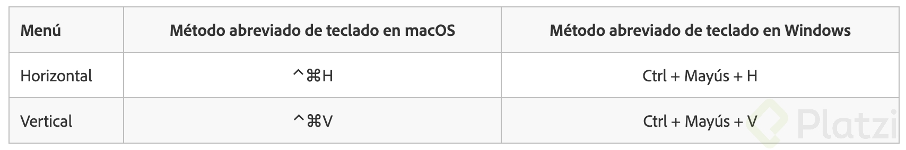

#### TEXTO

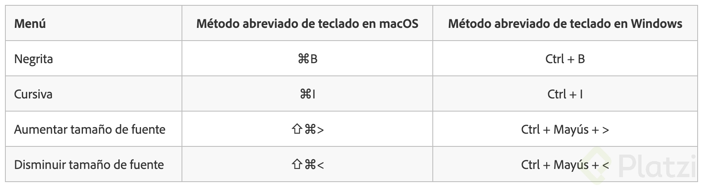

#### MENÚ HERRAMIENTAS

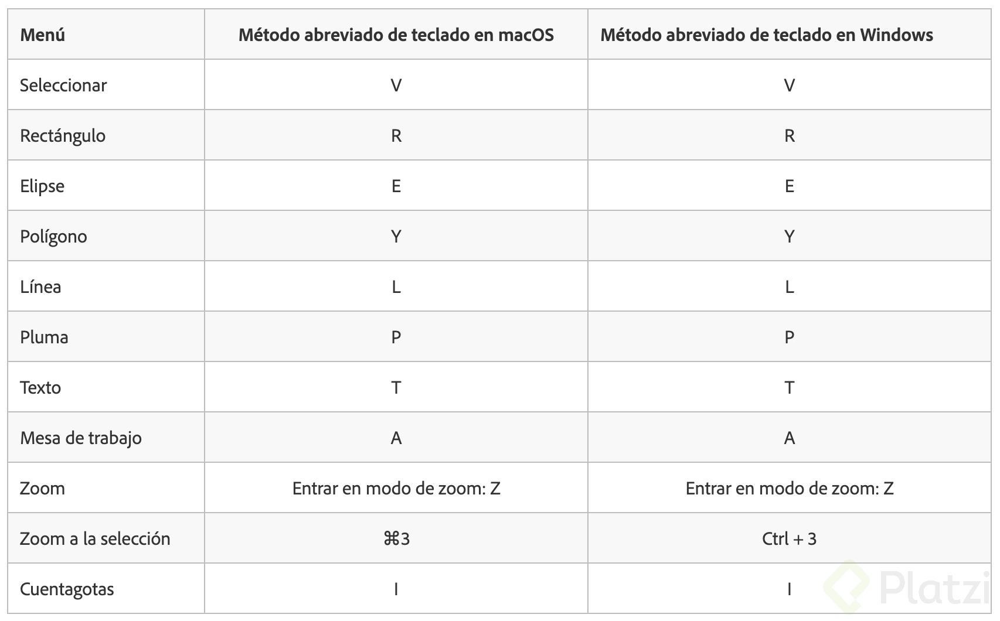

#### MEDICIÓN Y DISTANCIA ENTRE HERRAMIENTAS

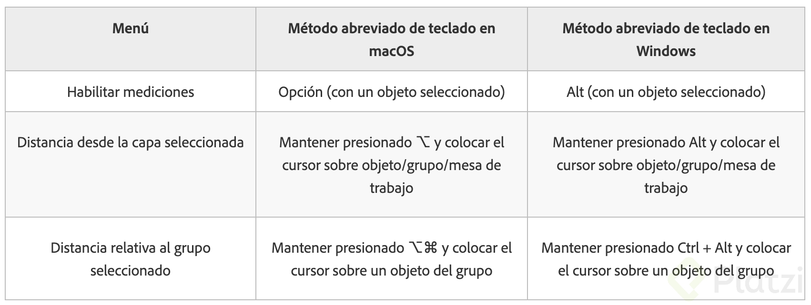

#### EDICIÓN DE VECTORES

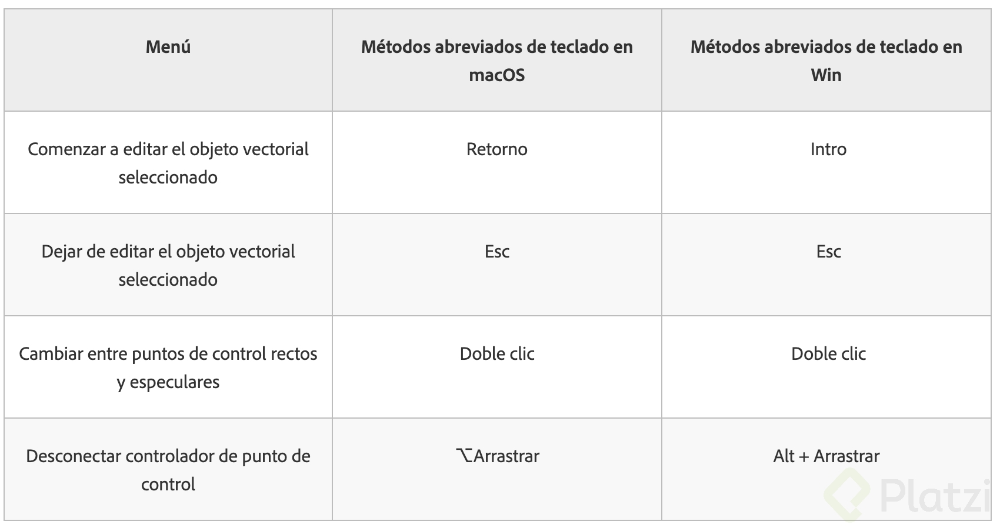

#### PROTOTIPOS

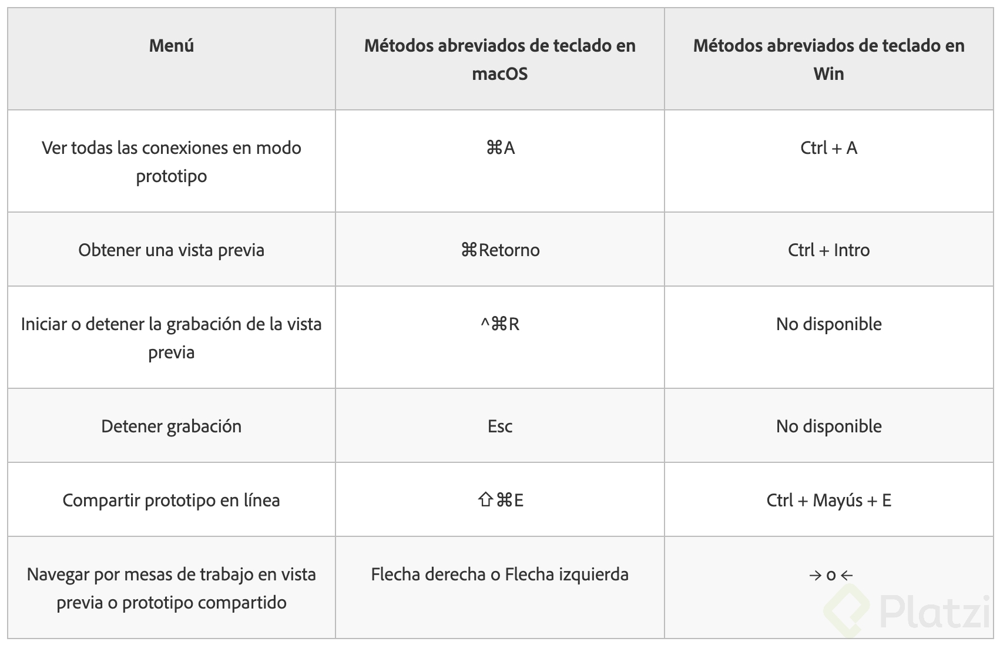

> En el siguiente link se pueden ver todos los atajos de teclado:
> [Shortcuts Adobde XD](https://helpx.adobe.com/content/dam/help/attachments/XDKeyboardshortcutsnew.pdf)
